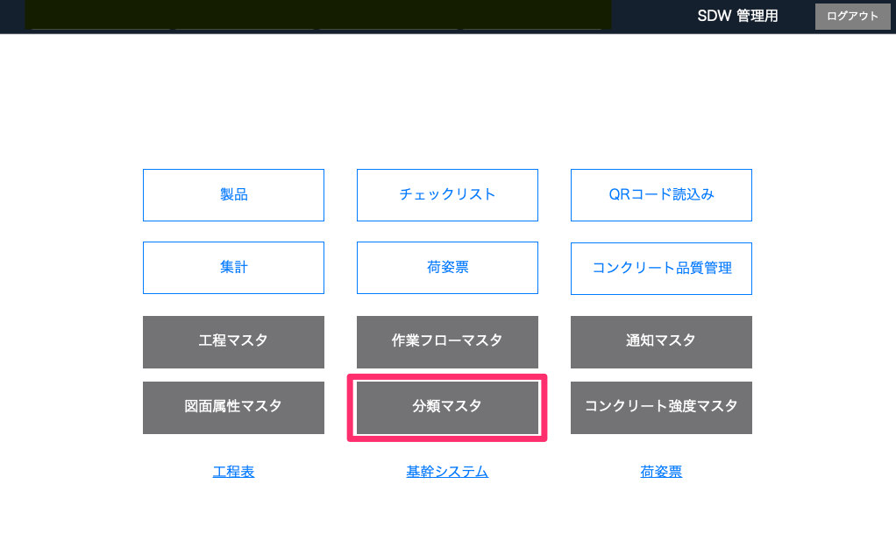
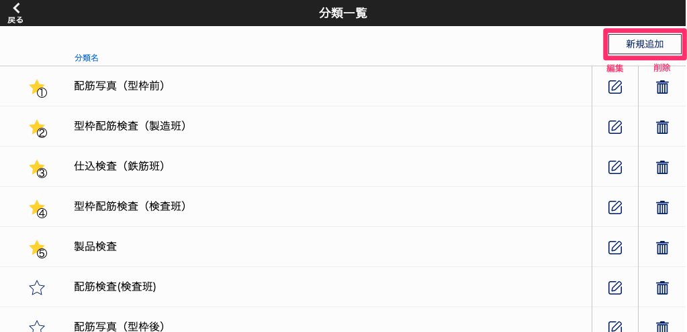
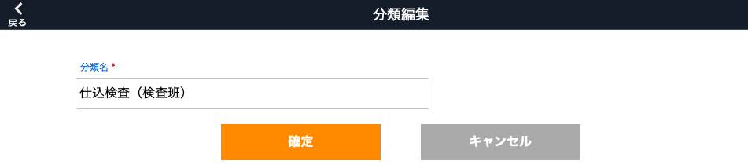
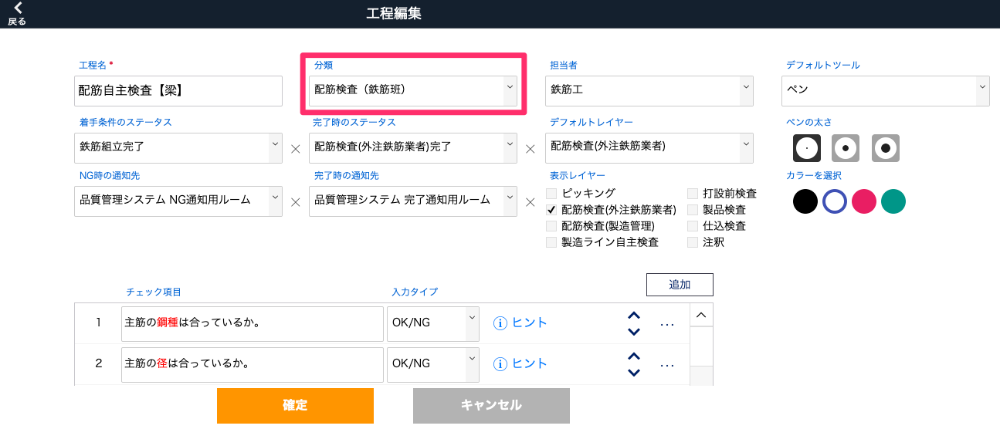
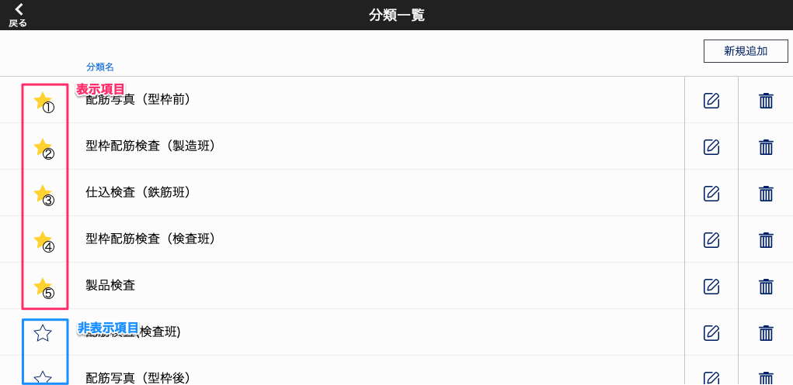
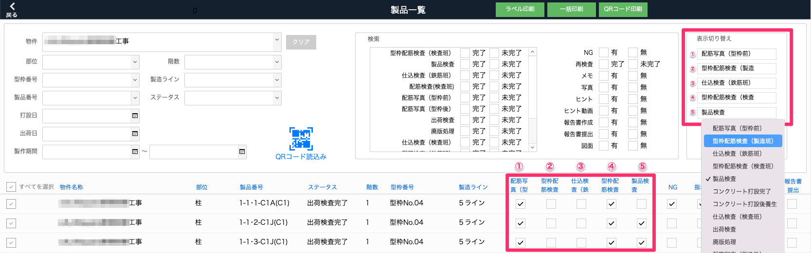

# 分類マスタ

### 工程の分類項目の設定をします。「工程マスタ」での工程の検索や、「製品一覧」での工程の状況の確認に使用します。

 
1. [品質管理システム]トップ画面から「分類マスタ」を選択します。

    <table><tr><td>
    
    </td></tr></table>

2. [分類一覧]画面から「新規追加」を選択します。

    <table><tr><td>
    
    </td></tr></table>

3. [分類名]を入力し、「確定」します。

    <table><tr><td>
    
    </td></tr></table>

4. 工程作成時に分類を選択できるようになります。

    <table><tr><td>
    
    </td></tr></table>

- 品質管理システム_製品_[製品一覧]画面で表示する分類項目を設定する　([製品一覧]画面からも切り替え可)

    [分類一覧]の星アイコンを選択すると、製品一覧のチェックボックスの表示/非表示を切り替えることができます。
    表示項目は最大5つまで選択でき、番号順に表示されます。表示選択した分類項目は、[分類一覧]で自動的に番号順に並び替えられます。

<table><tr><td>

</td></tr></table>

分類の表示項目の選択、並び替えは[製品一覧]画面の[表示切り替え]からも操作が可能です。

<table><tr><td>

</td></tr></table>