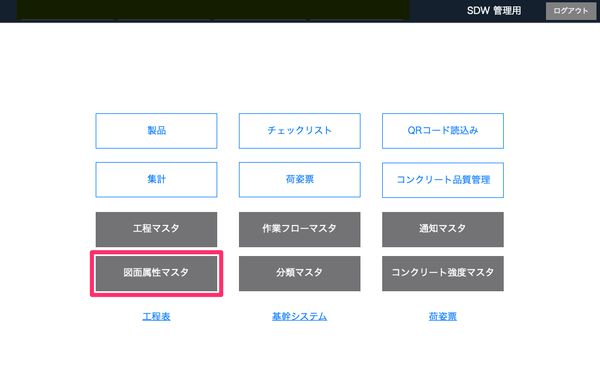
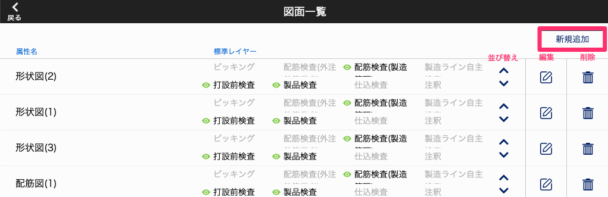
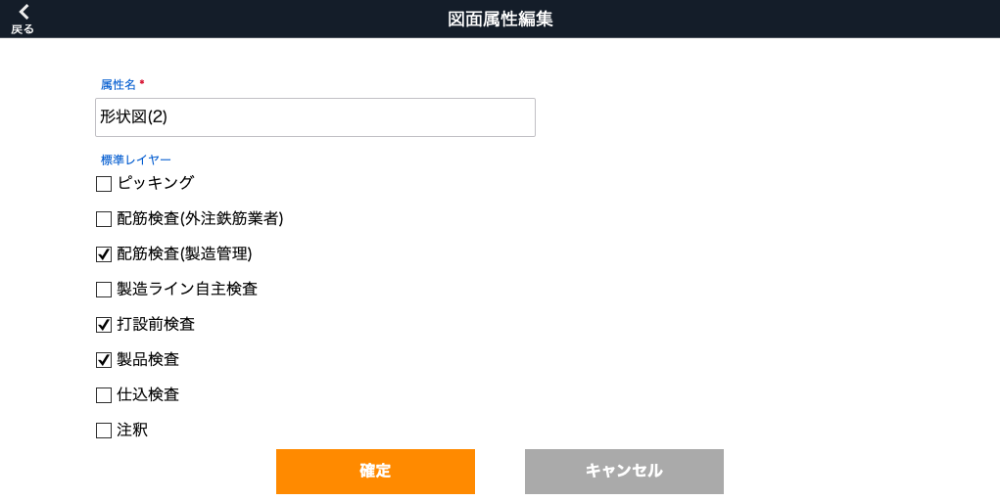
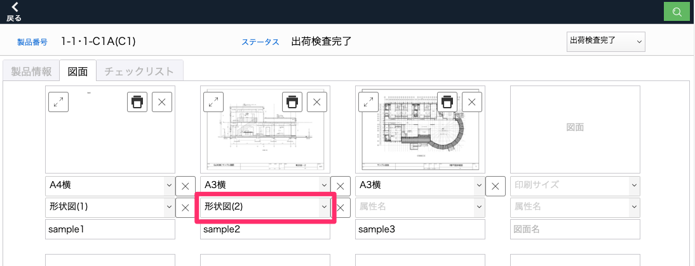
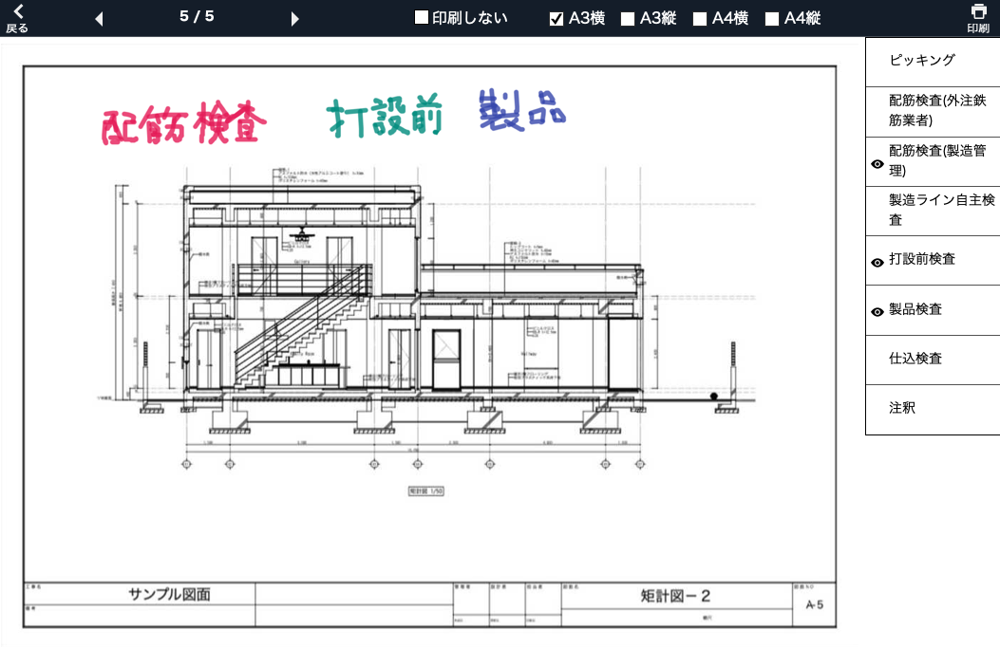

# 図面属性マスタ

### 図面の属性と、印刷時に属性に紐づけたレイヤーを標準で印刷する設定をします。

 
1. [品質管理システム]トップ画面から「図面属性マスタ」を選択します。

    <table><tr><td>
    
    </td></tr></table>

2. [図面一覧]画面から「新規追加」を選択します。

    <table><tr><td>
    
    </td></tr></table>

3. [属性名]を入力し、印刷時に標準で印刷したいレイヤーを選択して「確定」します。

    <table><tr><td>
    
    </td></tr></table>

4. 図面登録時に属性名として選択できるようになります。

    <table><tr><td>
    
    </td></tr></table>

図面印刷時、図面属性に紐づけたレイヤーが標準で印刷されるようになります。(下図では仕込検査レイヤーにも書き込みがありますが、形状図(2)の設定が適用され、印刷時に非表示になります。レイヤー名の左横の目アイコンを選択することで印刷の要否を切り替えられます)

<table><tr><td>

</td></tr></table>