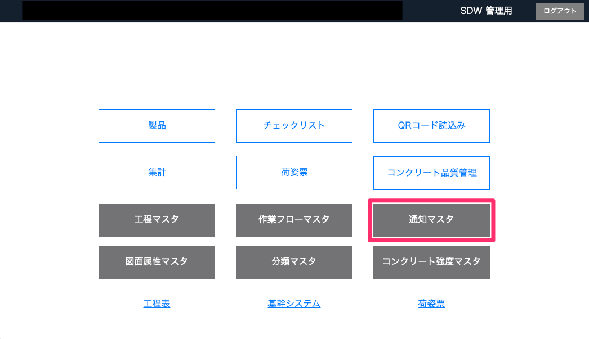
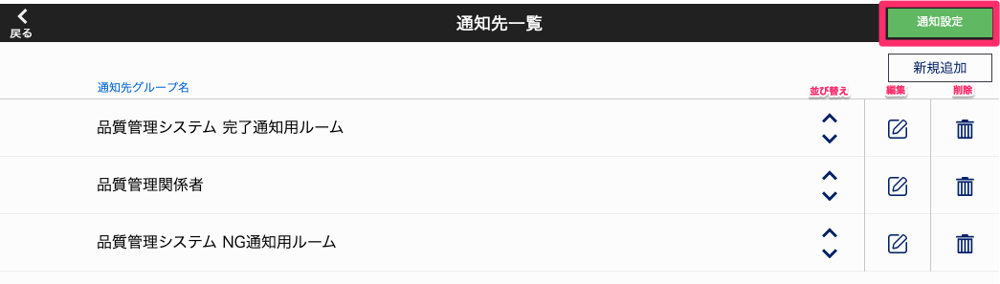
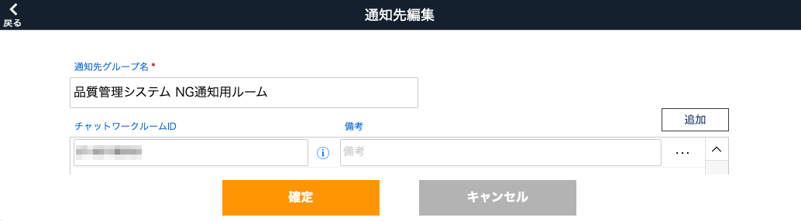
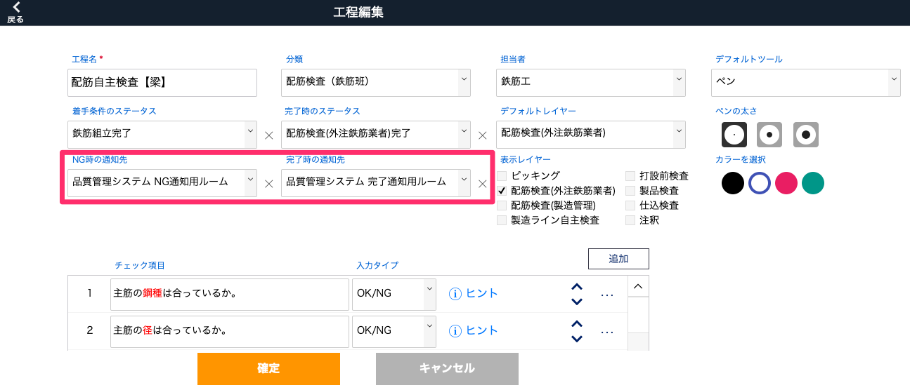

# 通知マスタ

### 工程のNG時、完了時の通知先(Chatworkのグループチャット)の設定をします。

 
1. [品質管理システム]トップ画面から「通知マスタ」を選択します。

    <table><tr><td>
    
    </td></tr></table>

1. [通知先一覧]画面から「通知設定」を選択します。

    <table><tr><td>
    
    </td></tr></table>

1. Chatworkの<a href="https://help.chatwork.com/hc/ja/articles/115000172402-API%E3%83%88%E3%83%BC%E3%82%AF%E3%83%B3%E3%82%92%E7%99%BA%E8%A1%8C%E3%81%99%E3%82%8B" target="_blank">APIトークンの発行</a>を行い、[チャットワーク通知設定]に入力して「確定」します。
1. [通知先一覧]画面から「新規追加」を選択します。

1. [通知先編集]画面で「追加」を選択します。「追加」を押すことで通知先を増やすことができます。
入力欄が黄色になっている項目は登録時に入力必須の項目になります。

1. [通知先グループ名][チャットワークルームID(<a href="https://help.chatwork.com/hc/ja/articles/360000142942-%E3%83%AB%E3%83%BC%E3%83%A0ID%E3%82%92%E7%A2%BA%E8%AA%8D%E3%81%99%E3%82%8B" target="_blank">ルームIDの確認方法参考</a>)][備考]を入力して「確定」します。

    <table><tr><td>
    
    </td></tr></table>

1. 工程作成時にNG時・完了時の通知先として選択できるようになります。

    <table><tr><td>
    
    </td></tr></table>