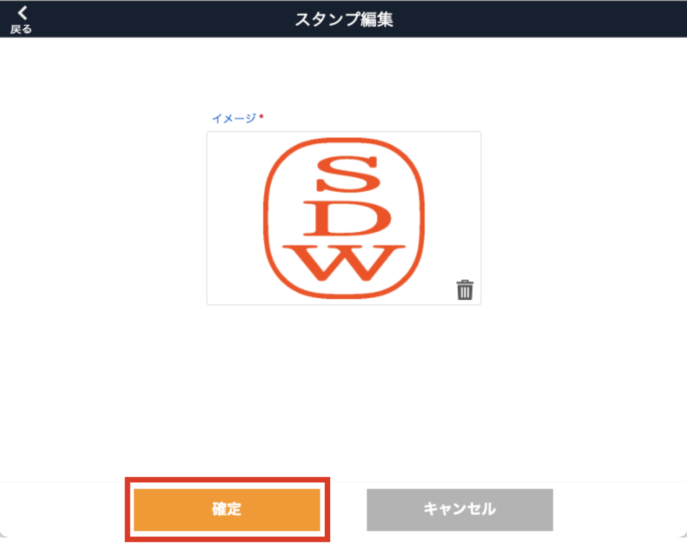

# スタンプマスタ

### 図面手描き機能で使うスタンプを登録します。

 
1. [品質管理システム]トップ画面から「スタンプマスタ」を選択します。

    <table><tr><td>
    
    </td></tr></table>

1. [スタンプ一覧]画面右上の「新規追加」を選択します。

    <table><tr><td>
    
    </td></tr></table>

1. [イメージ]に登録したいスタンプ（画像）を挿入し、[サイズ]に図面に表示させたいサイズをピクセル単位で指定します。

    <table><tr><td>
    
    </td></tr></table>

1. 入力したら「確定」をクリックすると登録が完了します。

    <table><tr><td>
    
    </td></tr></table>

1. 登録したスタンプは[スタンプ一覧]画面に表示されます。

    <table><tr><td>
    
    </td></tr></table>

    また、図面手描き画面のスタンプツールで使用できるようになります。

    <table><tr><td>
    
    </td></tr></table>

- スタンプの編集  
    登録済のスタンプのサイズ変更は下記のボタンから可能です。

    <table><tr><td>
    
    </td></tr></table>

{: .warning }
画像の差替は新規作成時しかできません。

- スタンプの削除  
    スタンプの削除は下記ボタンから可能です。

    <table><tr><td>
    
    </td></tr></table>

{: .note }
スタンプマスタを削除しても、すでに図面に押してあるスタンプは消えません。