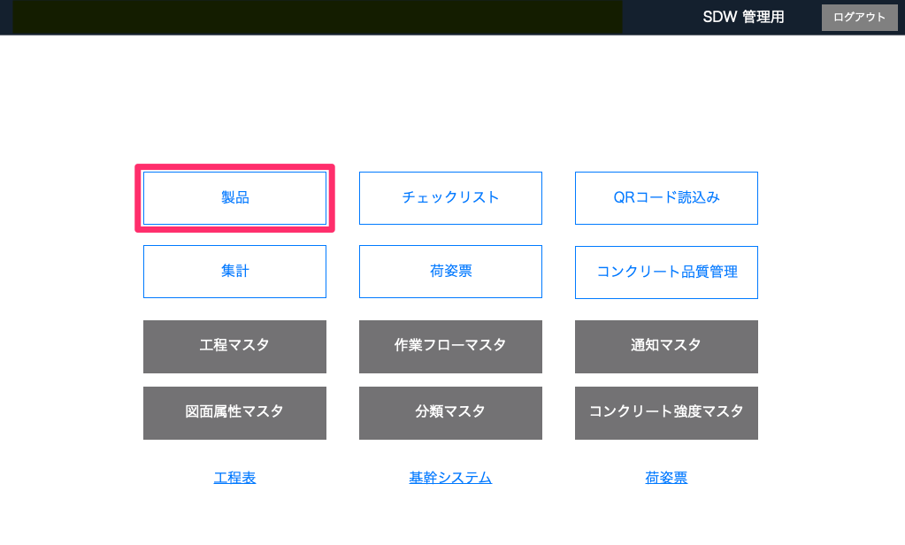

# 製品のチェックリストを表示する

 

[製品]からQRコードを読込む（iPad）

 
1. [品質管理システム]トップ画面から「製品」を選択します。
 
    <table><tr><td>
    
    </td></tr></table>
 
 

2. 検索欄にある「QRコード読込み」を選択し、製品のQRコードを読み込みます。
 
    <table><tr><td>
    
    </td></tr></table>
 
 

3. 製品の「チェックリスト」が表示されます。
 
    <table><tr><td>
    
    </td></tr></table>
 
 

[QRコード読込み]からQRコードを読込む（iPad）

 
1. [品質管理システム]トップ画面から「QRコードを読込み」を選択します。
 
    <table><tr><td>
    
    </td></tr></table>
 
 

2. 製品のQRコードを読み込みます。
 
 

3. 製品の「チェックリスト」が表示されます。
 
    <table><tr><td>
    
    </td></tr></table>
 
 

[チェックリスト]からQRコードを読込む（iPad）

 
1. [品質管理システム]トップ画面から「チェックリスト」を選択します。
 
    <table><tr><td>
    
    </td></tr></table>
 
 

2. 「QRコード読み込み」を選択し、製品のQRコードを読み込みます。
 
    <table><tr><td>
    
    </td></tr></table>
 
 

3. 製品の「チェックリスト」が表示されます。
 
    <table><tr><td>
    
    </td></tr></table>
 
 

[チェックリスト]から絞り込む

 
1. [品質管理システム]トップ画面から「チェックリスト」を選択します。
 
    <table><tr><td>
    
    </td></tr></table>
 
 

2. [物件]、[部位]、[製品番号]を入力して「確定」を選択します。
 
    <table><tr><td>
    
    </td></tr></table>
 
 

3. 製品の「チェックリスト」が表示されます。
 
    <table><tr><td>
    
    </td></tr></table>
 
 

{: .warning }
QRコードの読み込みはiPadのみの機能です。
