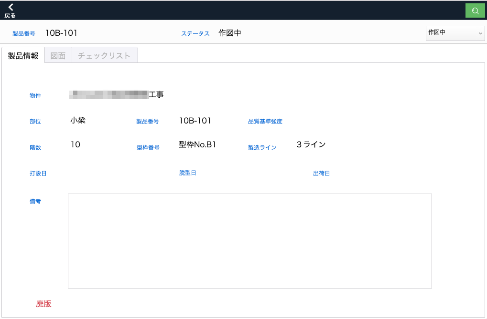
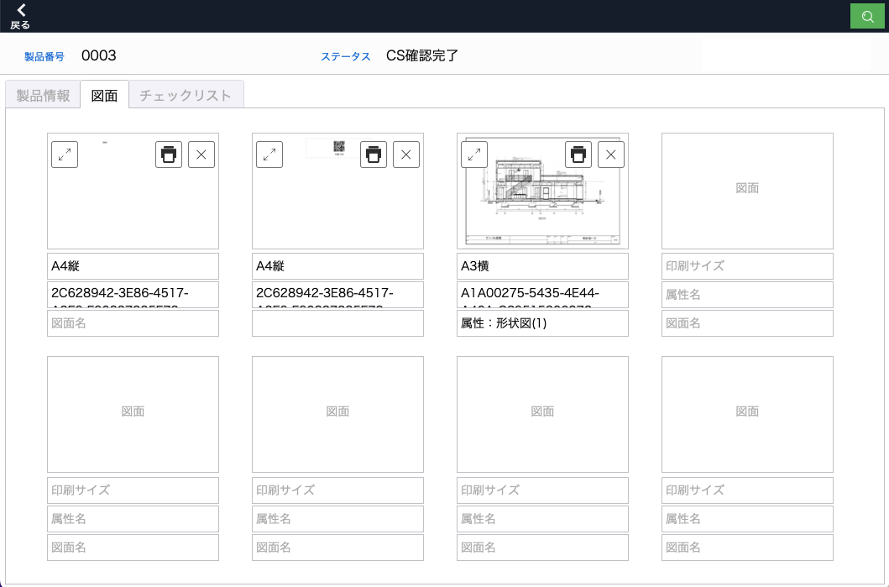
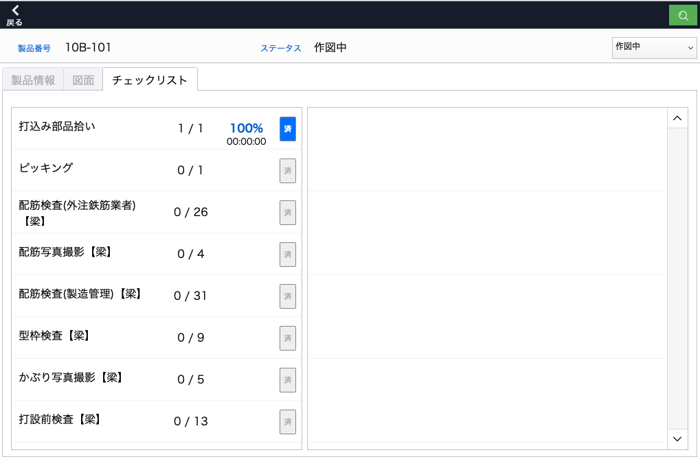
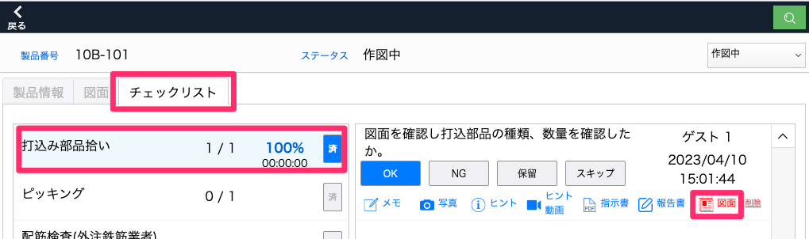

# 製品詳細画面

### 製品を選択すると「製品情報」、「図面」、「チェックリスト」タブが表示されます。

 
- 「製品情報」タブ

    製品の詳細情報を確認できます。備考の記入、製品を廃版にする操作ができます。

<table><tr><td>

</td></tr></table>

- 「図面」タブ

    製品に関する図面の確認ができます。品質チェック時に図面上のレイヤーに書き込んだり、書き込んだものを印刷することができます。

<table><tr><td>

</td></tr></table>

- 「チェックリスト」タブ

    製品の作業フローを確認できます。各工程を選択すると右枠にチェック項目が表示され、その項目をもとに製品の品質チェックを行います。

<table><tr><td>

</td></tr></table>

「チェックリスト」タブ内の各工程を選択すると、右枠にチェック項目が表示されます。

<table><tr><td>

</td></tr></table>

メモ、写真、ヒント、ヒント動画、指示書、報告書、図面ボタンは、内容が登録されていると、ボタンの色が青から赤に変わります。