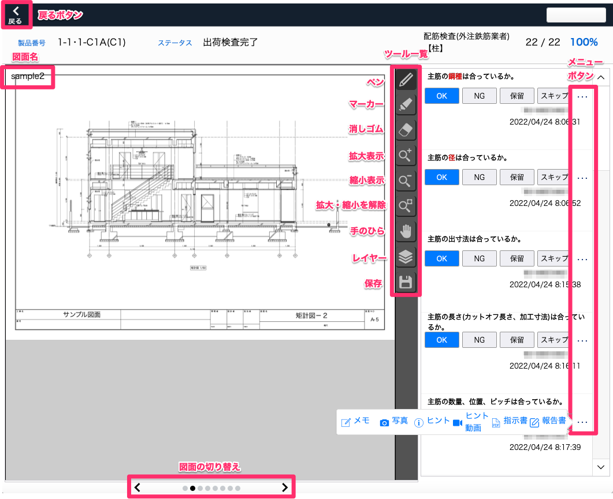
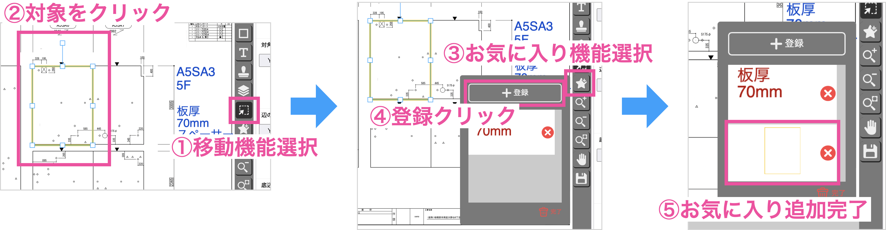

# 図面に手描きする

 
1. 「チェックリスト」タブ内のいずれかの工程を選択してチェック項目を表示したのち、「図面」を選択します。

    <table><tr><td>
    
    </td></tr></table>

1. 図面描き込み画面に遷移します。  
   図面の描き込みやチェックリストのステータス変更等を行うことができます。

    <table><tr><td>
    
    </td></tr></table>

### ツール詳細

| ツール           | 詳細                                                                                                                                                     | 
| ---------------- | -------------------------------------------------------------------------------------------------------------------------------------------------------- | 
| ペン、マーカー   | 右クリックor長押しで太さ、色の選択ができます。                                                                                                           | 
| 消しゴム         | 右クリックor長押しで太さを選択できます。                                                                                                           | 
| 四角枠           | 右クリックor長押しで枠の太さ、色の選択ができます。                                                                                                       | 
| テキストボックス | 右クリックor長押しで太さ、色の選択をし、任意のテキストを入力できます。                                                                                   | 
| スタンプ         | 右クリックor長押しでスタンプの選択ができます。   ※あらかじめ[スタンプマスタ]()にスタンプを登録しておく必要があります。 | 
| レイヤー(画層)   | 描き込む検査項目レイヤーの選択、表示/非表示を切り替えます。                                                                                              | 
| 選択ツール | 描き込んだ枠やテキストを選択して、移動やサイズ変更ができます。                                                                                                     | 
| お気に入り登録   | 枠やテキストをお気に入り登録し、ドラッグ&ドロップで使用できます。                                                                                        | 
| 拡大表示         | 画面を拡大表示することができます。                                                                                                                       | 
| 縮小表示         | 画面を縮小表示することができます。                                                                                                                       | 
| 拡大/縮小を解除  | 拡大/縮小表示した画面を元に戻します。                                                                                                                    | 
| 手のひら         | 表示画面を移動します。                                                                                                                                   | 
| 保存             | 保存、戻るボタン、図面の切り替えで手描き内容を保存できます。                                                                                             | 

- お気に入り登録方法  
    
<table><tr><td>

</td></tr></table> 

※長期間別のアプリを使用したりiPadをスリープする場合は保存をしてください。

{: .warning }
複数人で同時に同じ図面の同一レイヤーに書き込むと、最後に保存した内容しか保存されません。異なるレイヤーでの描画内容は問題なく保存されます。

以下の状況で、「他に図面データを編集している方がいるため、保存できませんでした。再度やり直してください。」というエラーメッセージが表示される場合がありますが、メッセージウインドウを閉じて１〜２秒ほど待つと保存可能になります。
- 複数人で同じ図面の異なるレイヤーを操作して、同じタイミングで保存した
- 別の人が図面PDFを登録している最中