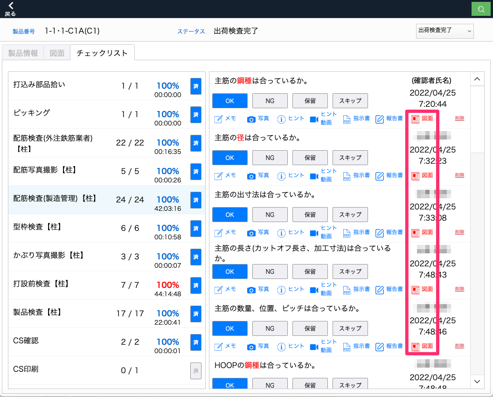

# 図面に手描きする

 
1. 「チェックリスト」タブ内のいずれかの工程を選択してチェック項目を表示したのち、「図面」を選択します。

    <table><tr><td>
    
    </td></tr></table>

1. 図面書き込み画面に遷移します。

    <table><tr><td>
    
    </td></tr></table>

 
- 図面に書き込む

ツール

 
ペン、マーカー：右クリックで太さ、色の選択ができます。
 
消しゴム： 右クリックで太さを選択できます。
 
レイヤー(画層)： 描き込む検査項目レイヤーの選択、表示/非表示を切り替えます。
 
手のひら：表示画面を移動します。
 
保存：保存、戻るボタン、図面の切り替えで手書き内容を保存できます。
 
 
※長期間別のアプリを使用したりiPadをスリープする場合は保存をしてください。
 
 

{: .warning }
複数人で同時に同じ図面の同一レイヤーに書き込むと、最後に保存した内容しか保存されません。異なるレイヤーでの描画内容は問題なく保存されます。

以下の状況で、「他に図面データを編集している方がいるため、保存できませんでした。再度やり直してください。」というエラーメッセージが表示される場合がありますが、メッセージウインドウを閉じて１〜２秒ほど待つと保存可能になります。
- 複数人で同じ図面の異なるレイヤーを操作して、同じタイミングで保存した
- 別の人が図面PDFを登録している最中