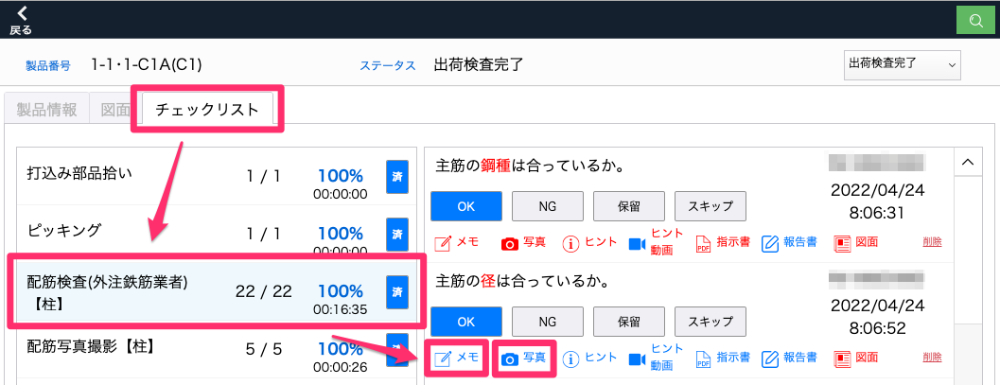
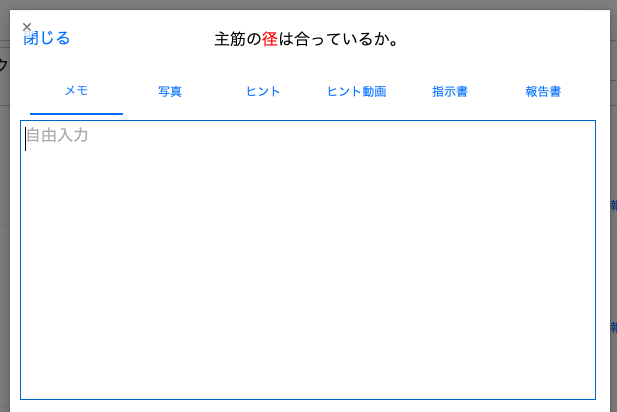
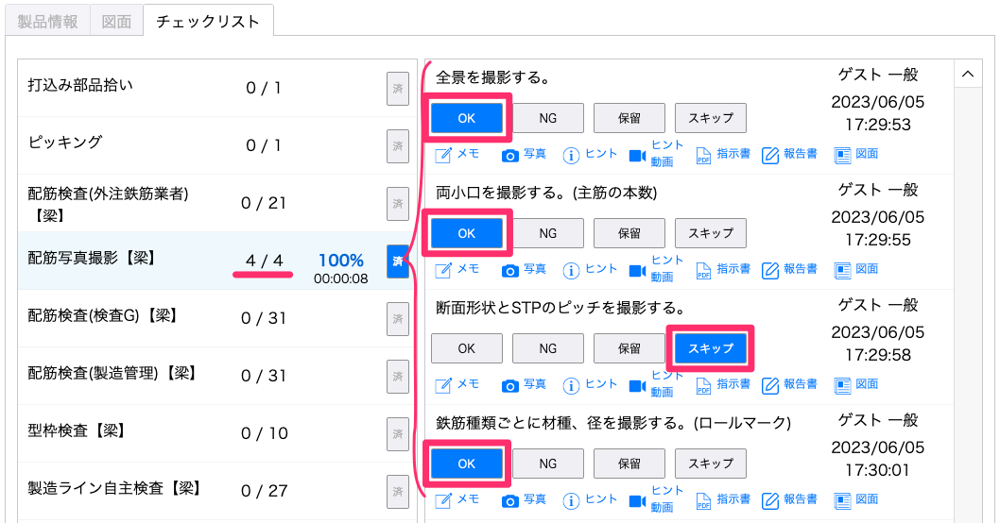
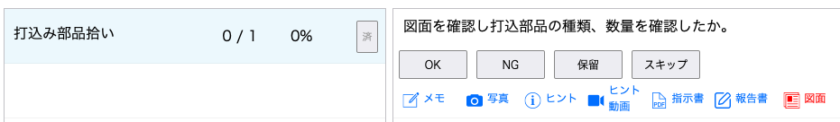
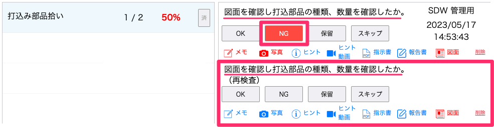
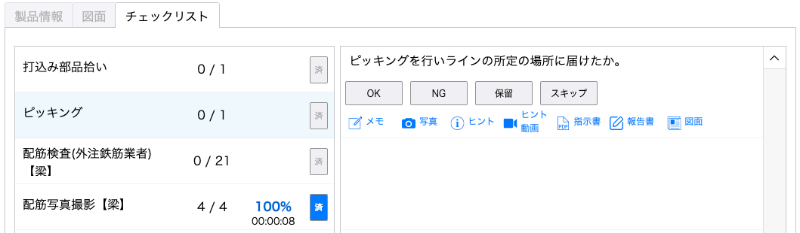
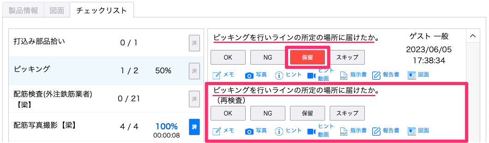

# 製品の品質チェックをする

 

ヒント・動画ヒントを確認する

 
1. 「チェックリスト」タブ内で工程を選択し、チェック項目の「ヒント」を選択します。
 
 

2. ヒントテキスト・ヒント写真が表示されます。画像左上のボタンを選択すると拡大表示できます。
 
 

チェック項目に情報を追加する

 
・メモ・写真を登録する
 
1. 「チェックリスト」タブ内で工程を選択し、チェック項目の「メモ」、「写真」を選択します。
 
    <table><tr><td>
    
    </td></tr></table>
 
 

2. メモを記入、写真枠をタップし写真撮影をして登録します。
 
写真撮影はiPadのみの機能です。
 
    <table><tr><td>
    
    </td></tr></table>
 
 

・報告書を登録する
 
1. 「チェックリスト」タブ内で工程を選択し、チェック項目の「報告書」を選択します。
 
 
2. [登録名]または[フリガナ]で検索して作成者を登録し、報告書をpdf形式で挿入します。
 
 

チェック項目のステータスを変更する

 
工程のチェック項目が全て「OK」または「スキップ」のとき、工程が完了済みとなります。
 
 
・チェック項目を「OK」、「スキップ」にする
 
「チェックリスト」タブ内で工程を選択し、チェック項目の「OK」、「スキップ」を選択します。
 
    <table><tr><td>
    
    </td></tr></table>
 
 

・チェック項目を「NG」にする
 
1. 「チェックリスト」タブ内で工程を選択し、チェック項目にメモと写真を登録します。
 
 

2. 「NG」を選択します。再検査となり、工程内に同内容のチェック項目が生成されます。
 
    <table><tr><td>
    
    </td></tr></table>
↓
    <table><tr><td>
    
    </td></tr></table>
 
 
・チェック項目を「保留」にする
 
「チェックリスト」タブ内で工程を選択し、チェック項目の「保留」を選択します。再検査となり、工程内に同内容のチェック項目が生成されます。
 
    <table><tr><td>
    
    </td></tr></table>
↓
 
    <table><tr><td>
    
    </td></tr></table>

