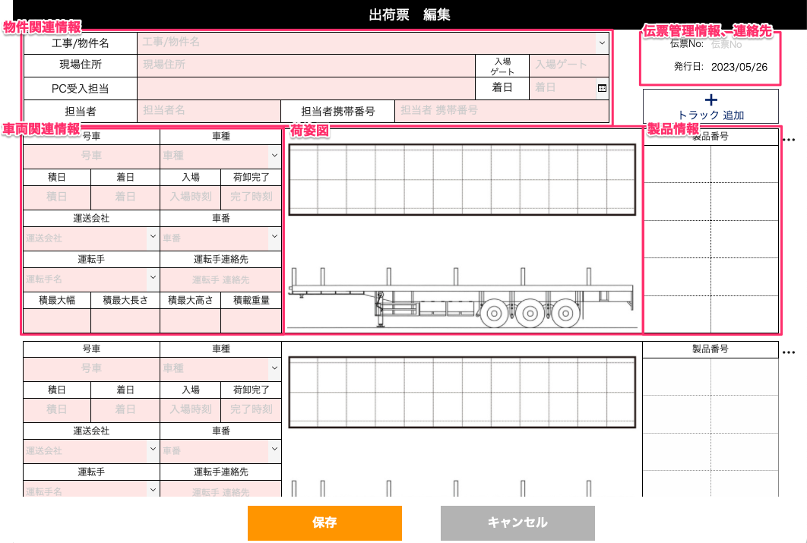

# 荷姿票各項目詳細

 

    
伝票管理情報、連絡先

     
    ・伝票No
       
        着日(製品が現場に到着する日付)を元に[西暦下二桁-着日-物件コード]の形式で発番します。
         
        例）着日が2023年1月1日、物件コードが001の場合：23-0101-001
         
        (項目設定　基幹システム：物件マスタ > 物件コード)
     
     
    ・発行日
       
        荷姿票を作成した日付が自動入力されます。
     
      
    ・(印刷時に表示)発注会社情報
       
        発注会社の名称と住所、電話番号が表示されます。
     
     

    
物件関連情報

     
    ・工事/物件名、現場住所
       
        (項目設定　基幹システム：物件マスタ > 名称、現場住所)
     
      
    ・入場ゲート(自由記述)
     
       
        搬入口のゲート番号などを設定できます。
     
     
    ・着日
       
        製品が現場に到着する日付を設定します。
      
     
    ・PC受入担当
       
        (項目設定　基幹システム：物件マスタ > PC受入担当)
     
        ※ 印刷時末尾に敬称(様)が記載されます。
     
     
    ・担当者(発注側)、担当者(発注側)携帯番号
       
        伝票管理情報欄に記載されます。
      
        (項目設定　基幹システム：物件マスタ > 現場担当者、携帯番号)
     
     

    
車両関連情報

     
    ・号車
     
        配送に使用する車両の番号を設定します。トラックの識別番号などを任意の値で設定できます。
     
     
    ・車種
       
        「トレーラー」、「低床トレーラー」、「平ボディ」をプルダウンで設定できます。
     
     
    ・積日、着日
       
        搬入物の積日、搬入日の着日を設定できます。
     
     
    ・入場、荷卸完了
     
        搬入時刻、荷卸の完了時刻を設定できます。
     
       
    ・運送会社
     
        基幹システム内の「運送会社」マスタに登録された業者から選択します。
     
        ※ この項目に登録されることで、WEB出荷管理システムから荷姿票情報にアクセスできるようになります。
     
        (項目設定　基幹システム：運送業者マスタ > 名称)
     
      
    ・車番、運転手、運転手連絡先
       
        [配送業者がWEB工程表から記入]します。
      
        (項目設定　WEB出荷管理システム：車両マスタ、運転手マスタ > 車両番号、氏名、運転手 電話番号)
     
     
    ○配送業者が再委託した場合
     
        <table><tr><td>
        
        </td></tr></table>
    品質管理システム：荷姿票 > 荷姿票一覧 > 閲覧で、外部委託会社が赤文字で表記されます。
     
     
    ○配送業者が登録した情報は、基幹システム：運転手/車両マスタから確認できます。(再委託先は登録されません)
     
        <table><tr><td>
        
        </td></tr></table>
     
    ・ 積最大幅(mm)、積最大長さ(mm)、積最大高さ(mm)、積載重量(t)(数字、単位自動入力)
     
        トラックの荷台の最大幅(mm)、最大長さ(mm)、最大高さ(mm)、積載重量(t)を設定できます。(単位自動入力)
     
     

    
荷姿図

     
    荷物をどう積載するか図面に書き込みます。
     
     
    ＜手書き画面の仕様＞
     
    車両の天面図、側面図のテンプレート上に描画することができます。
     
     
    1. [製品番号]欄に積載する製品の登録をします。(製品番号のテキストが荷姿図に自動挿入されるため、作図、荷姿票の複製で作業を簡略化できます。)
     
     
    2. 荷姿図欄を選択します。
     
     
    3. 図面書き込み画面に遷移します。
     

        

            
ツール

             
            <table><tr><td>
            
            </td></tr></table>
             
            ＜描画する＞
             
            ○矩形、円形：ドラッグ&ドロップで矩形、円を描くことができます。
             
            ○テキスト：図面上で選択するとテキストボックスが生成されます。  
             
            　・編集を終了：Enter
             
            　・改行：Shift + Enter
             
            　・テキストを再編集：テキストをダブルクリック
             
            ○ペン、マーカー：フリーハンドで描画することができます。右クリックで太さ、色の選択ができます。
             
             
            ＜描画部分の削除＞
             
            消しゴム：右クリックで太さを選択できます。
             
             
            ＜図形、テキストの操作＞
             
            ○選択：図形、テキストを選択すると水色の枠で囲まれまれてオブジェクトが選択状態になり(複数選択可)、この状態で移動、回転、変形が可能です。
             
            ○重ね合わせ：選択しているオブジェクトの階層を変更することができます。
             
            ・前面へ：一つ上げる
             
            ・最前面へ：最前面へ上げる
             
            ・背面へ：一つ下げる
             
            ・最背面へ：最背面へ下げる
             
             
            ＜お気に入り＞
             
            選択状態になっているオブジェクトをお気に入りに保存、お気に入りに保存したセットの呼び出し・削除ができます。
             
             
            ＜画面の操作＞
             
            ○虫眼鏡：拡大、縮小、拡大率のリセットができます。
             
            ○手のひら：図面の表示範囲の移動ができます。
             
             
            ＜保存＞
             
            保存、戻るボタン、図面の切り替えで手書き内容を保存できます。
             
            長時間別のアプリを使用する、iPadをスリープする等の場合には保存をしてください。
             
            複数人で同時に同じ図面に書き込むと、最後に保存した内容しか保存されません。
        

     
     

    
製品情報

     
    <table><tr><td>
    
    </td></tr></table>
       
    (項目設定　基幹システム：製品マスタ > 製品番号)
     
    (ステータス参照　品質管理システム：作業フローマスタ > [部位] > [工程] > 完了時のステータス)
     
     
    1. [製品番号]欄を選択します。
     
     
    2. [荷姿票]に[物件]が登録されている場合、物件に登録している製品一覧が表示されます。または[製品選択]画面で階数、型枠番号、部位、製造ライン条件で製品番号を絞り込むと検索結果が表示されます。
     
     
    3. 製品のチェックボックスを選択します。
     
     
    4. 荷姿票の[製品番号]欄に製品が追加されます。
      
        チェックボックスのチェックを外すと荷姿票から製品が削除されます。
     
     
    5. 製品が追加されると、自動で荷姿図にも製品名が転記されます。製品を登録解除すると荷姿図の製品名も削除されます。
     
    出荷検査済、他の車両に積載済みの製品は選択できません。
     
     
    ※ 出荷検査の工程がある場合、製品のステータスが[出荷検査完了]になると製品欄の表示が灰色になります。

- トラック追加  
    「トラック追加」を選択すると、車両情報、荷姿図、製品情報欄が追加されます。
    
- トラックの削除  
    製品番号欄の右の「…」から「削除」を選択すると、トラックの車両情報、荷姿図、製品情報が削除されます。