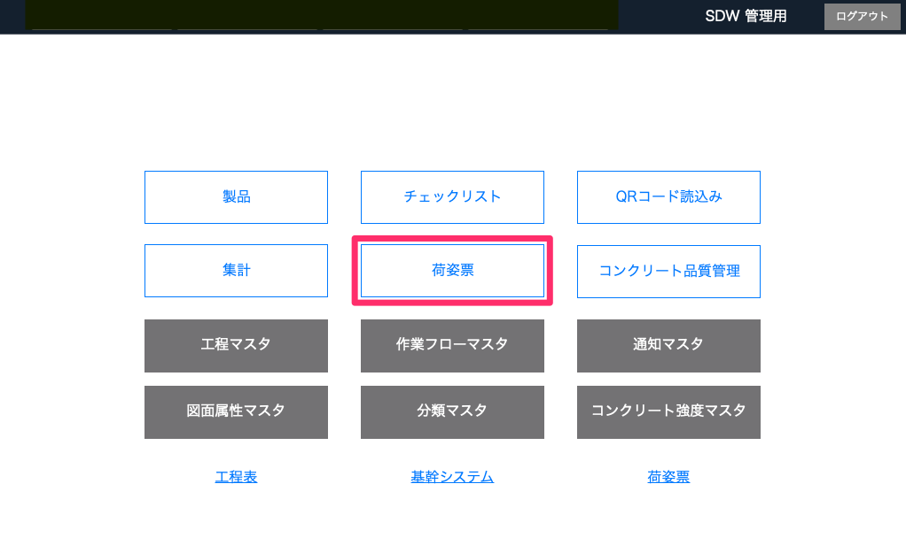
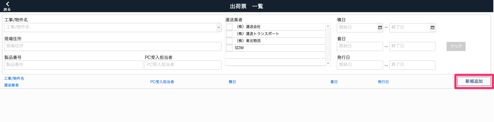
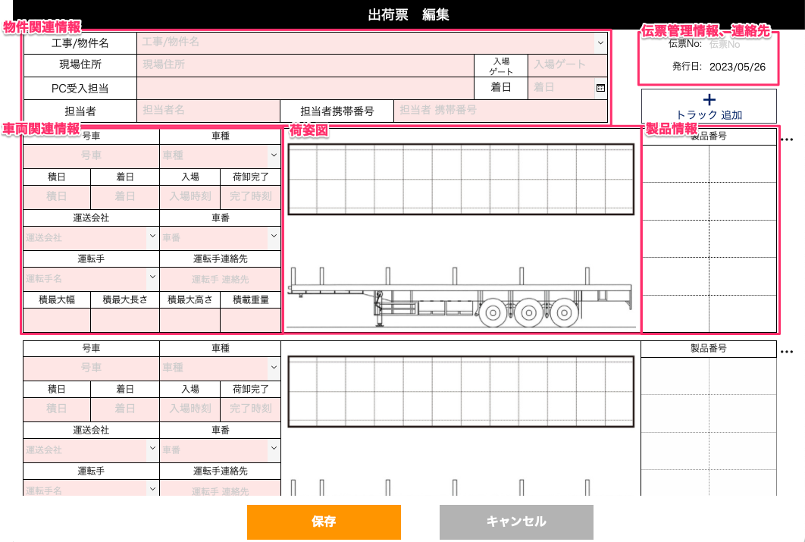
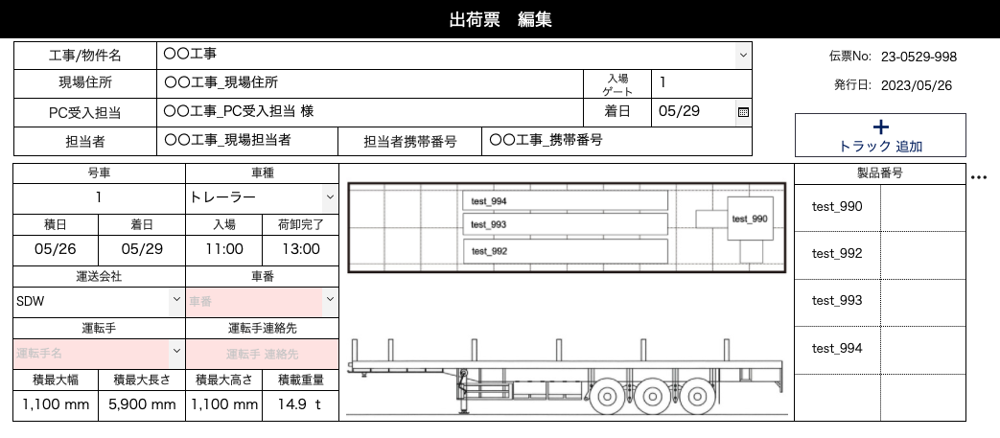
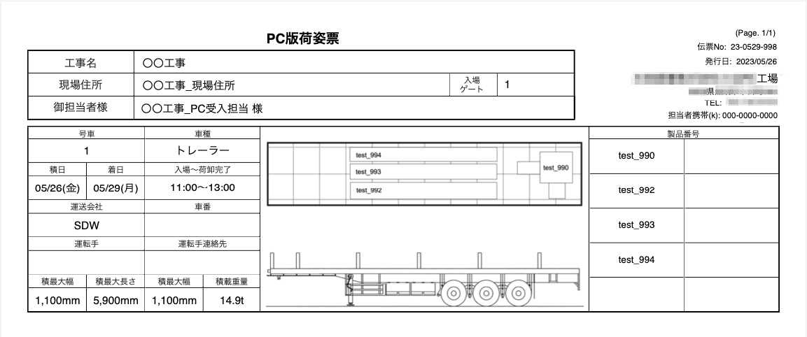

# 荷姿票を作成する

 
- 荷姿票の作成

    1. 「品質管理システム」トップ画面から「荷姿票」を選択します。

        <table><tr><td>
        
        </td></tr></table>

    1. [荷姿票一覧]画面から「新規追加」を選択します。

        <table><tr><td>
        
        </td></tr></table>

    1. [荷姿票編集]画面で荷姿票の形式に沿って項目を記入します。各項目欄を選択すると内容を編集できます。

        <table><tr><td>
        
        </td></tr></table>

     
    記入例

    <table><tr><td>
    
    </td></tr></table>

    印刷レイアウト

    <table><tr><td>
    
    </td></tr></table>

 
- 荷姿票の削除

[荷姿票一覧]から削除したい荷姿票の「閲覧」を選択します。画面右上の「…」ボタンから削除します。