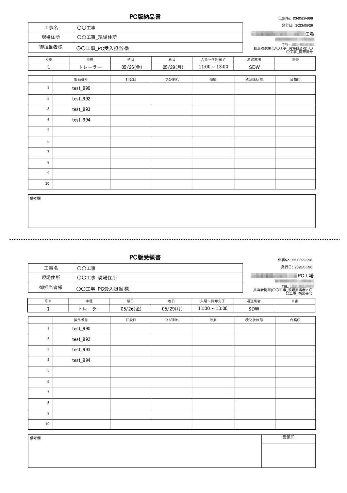

# 荷姿票、受領書、納品書の印刷をする

 
1. 品質管理システム_荷姿票_荷姿票一覧から受領書・納品書を作成したい製品を選択し「閲覧」を選択します。

2. [荷姿票詳細]詳細画面で「荷姿票」「納品書、受領書」ボタンを選択します。
    
    {: .warning }
    ※ 車両ごとの印刷になります

3. プリント設定を確認して印刷します。

 
<table><tr><td>

</td></tr></table>