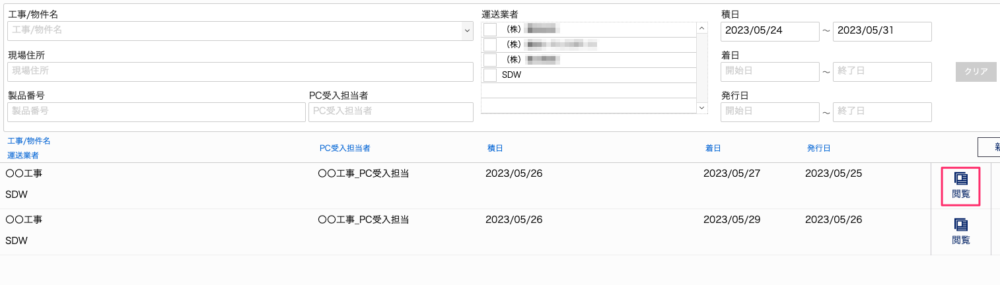
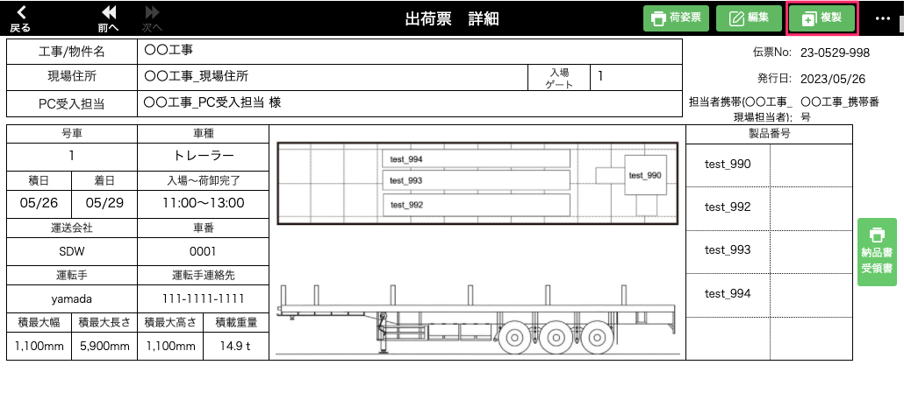
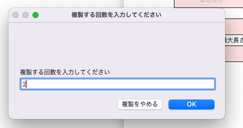
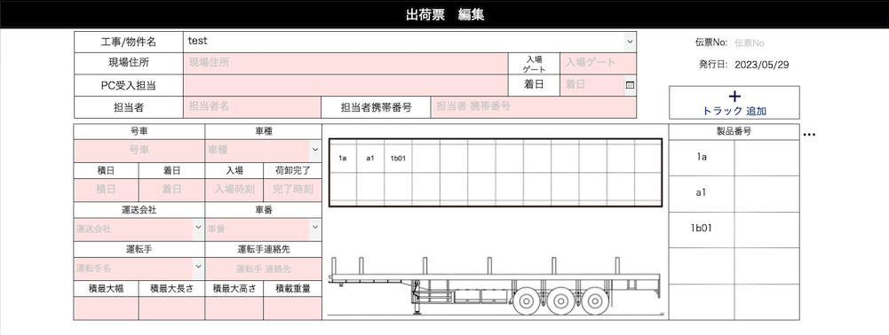
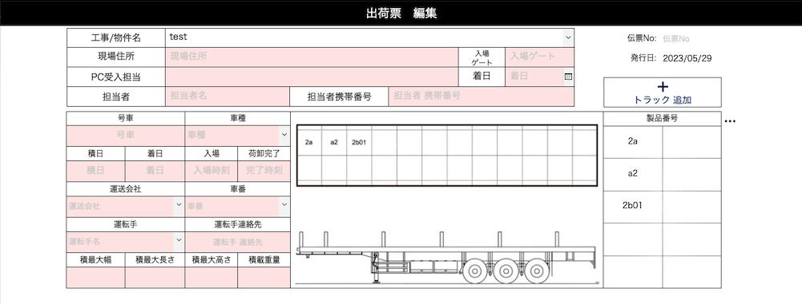
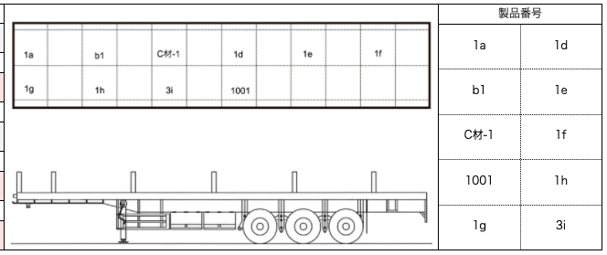
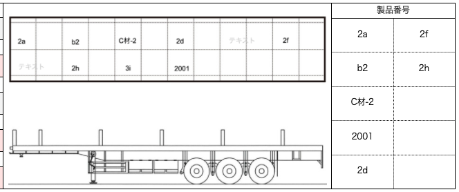

# 荷姿票を複製する

### 作成された荷姿票を同じ荷姿図の内容で複製します。

 
1. [荷姿票一覧]画面から複製したい荷姿票の「閲覧」を選択します。

    <table><tr><td>
    
    </td></tr></table>

1. 「複製」を選択します。

    <table><tr><td>
    
    </td></tr></table>

1. ポップアップウィンドウの記入欄に複製後の階数を入力します。

    <table><tr><td>
    
    </td></tr></table>

1. 製品情報、荷姿図の製品番号が複製する階数に置き換わった状態で荷姿票が複製されます。
    対応する複製可能な製品がない場合は置き換えはスキップされます。
    <table><tr><td>
    
    </td></tr></table>

    <table><tr><td>
    
    </td></tr></table>

- 複製可能な製品の命名規則について
    
    製品番号を先頭から確認した際に、最初に出てきた数字を階数と見なします。その他項目の違いによる複製の可・不可は下記の表をご参考ください。
    
    例）1階→2階 への複製

    <table><tr><td>
    
    </td></tr></table>

    <table><tr><td>
    
    </td></tr></table>

|        | [数字]〇〇 | 〇〇[数字] | 〇〇-[数字] | 数字のみ | 部位が異なる | 型枠番号 が異なる | 製造ライン が異なる | 物件が異なる | ステータス が異なる | 階数と関連性のない数字       | 
| ------ | ---------- | ---------- | ----------- | -------- | ---------------- | -------------------- | ---------------------- | ------------ | ---------------------- | -------------------------------- | 
| 複製前 | 1a         | b1         | C材-1       | 1001     | 1d               | 1e                   | 1f                     | 1g           | 1h                     | 3i                               | 
| 複製後 | 2a         | b2         | C材-2       | 2001     | 2d               | (複製失敗)           | 2f                     | (複製失敗)   | 2h                     | (複製失敗、テキストのみ複製) | 

{: .warning }
※ 1E-1{(数字)E±(数字)}などは[エクセルデータインポート]()の際に指数(Exponent)として認識されてしまうため避けてください。