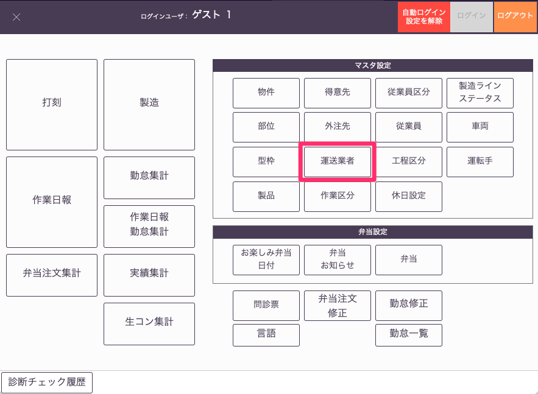
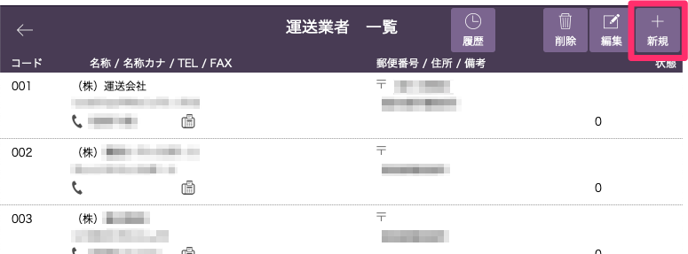
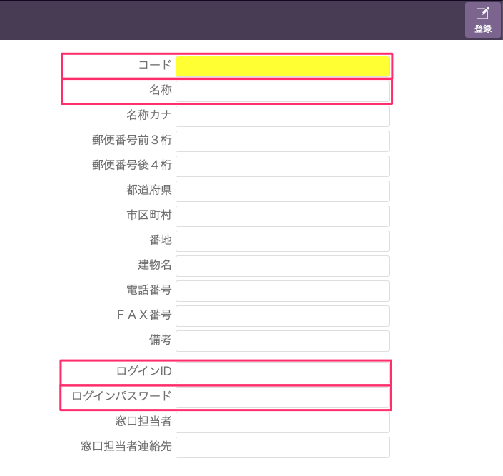

# 運送業者登録

 
1. 「基幹システム」トップ画面の[マスタ設定]から「運送業者」マスタを選択します。

    <table><tr><td>
    
    </td></tr></table>

1. [運送業者一覧]画面から「新規」を選択します。

    <table><tr><td>
    
    </td></tr></table>

    <table><tr><td>
    
    </td></tr></table>

1. [コード]、[名称]、[ログインID]、[ログインパスワード]を設定し、「登録」ボタンを選択します。
[コード]以外は入力必須項目ではありませんが、WEB出荷管理システムへのログイン情報、荷姿票、受領書・納品書に記入される情報となります。

1. 運送業者一覧に業者が登録されます。[荷姿票作成時]()に運送業者を選択することができるようになります。
また、登録された運送業者は[ログインID]と[ログインパスワード]を使用してWEB出荷管理システムにログインできるようになり、荷姿票に車両と運転手情報を登録できるようになります。