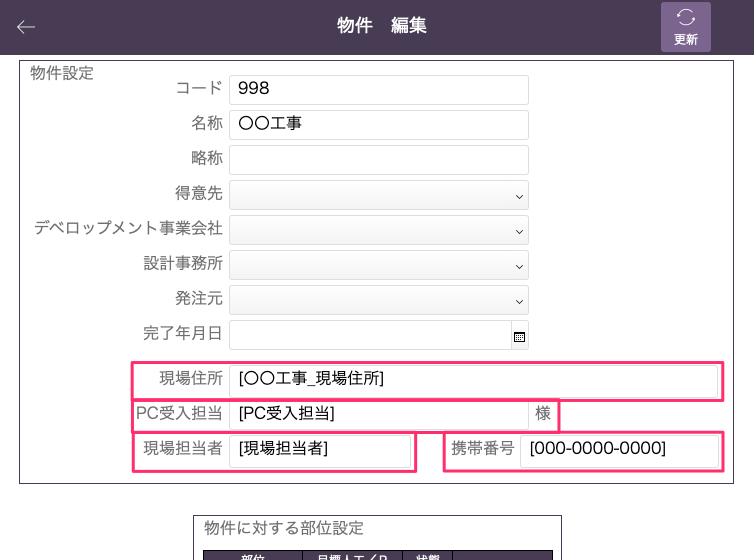

# 物件登録(情報追加)

### 荷姿票を作る上で必要な情報を物件マスタに追加します。

 
1. 物件情報の編集画面に移動します。  
    基幹システム：物件 > 物件一覧(情報追加したい物件を選択) > 編集

1. [現場住所]、[PC(プレキャスト)受入担当]、[現場担当者]、[携帯番号]を設定します。荷姿票、受領書・納品書などで記載、各システムで表示されます。

    <table><tr><td>
    
    </td></tr></table>

