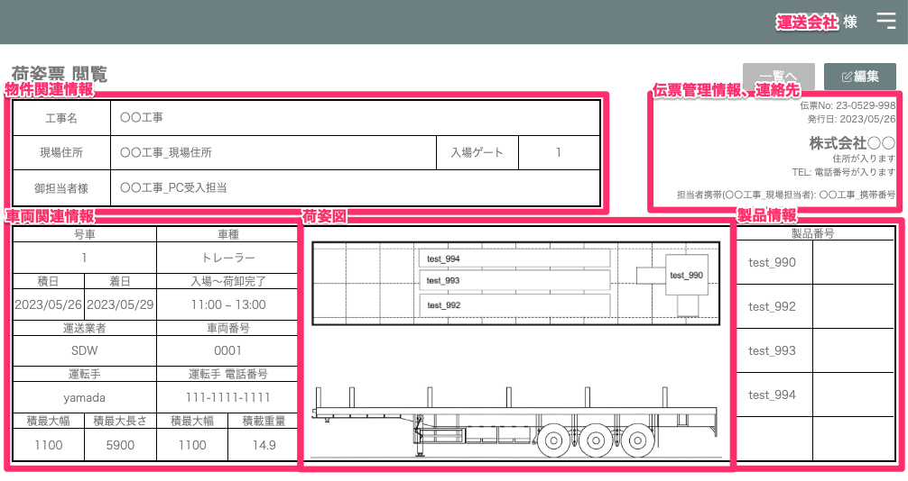
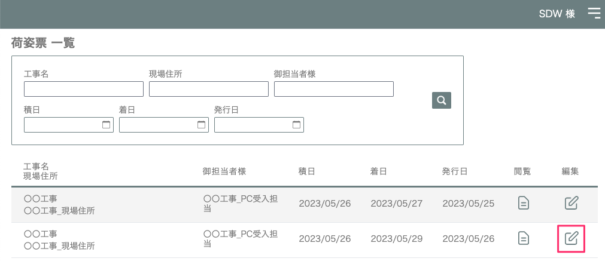
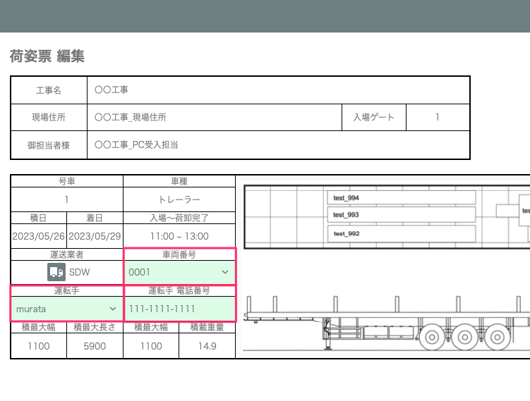
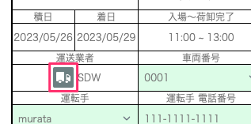
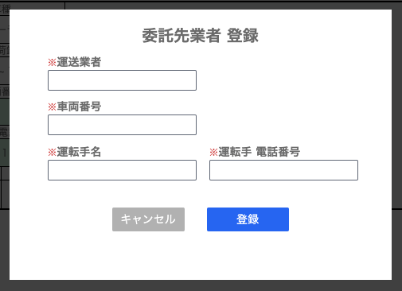

# 荷姿票に[運転手]、[運転手電話番号]、[車番]を登録する

 

<table><tr><td>

</td></tr></table>

{: .warning }
事前に車両、運転手マスタの設定が必要です。

1. [出荷票一覧]画面から編集したい荷姿票の「編集」を選択します。

    <table><tr><td>
    
    </td></tr></table>

1. [車両番号]、[運転手]を選択します。[運転手 電話番号]は運転手マスタから参照され自動で入力されます。

    <table><tr><td>
    
    </td></tr></table>

 
- 外部委託する  
    [配送業者]欄のトラックアイコンを選択します。委託先業者の[運送業者]、[車両番号]、[運転手]、[運転手 電話番号]の情報を登録します。

    <table><tr><td>
    
    </td></tr></table>

    <table><tr><td>
    
    </td></tr></table>