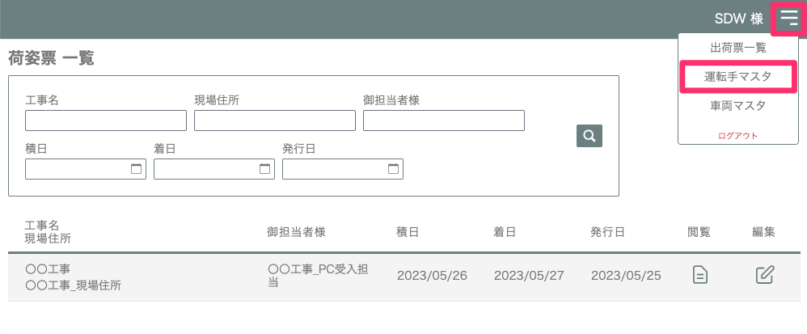
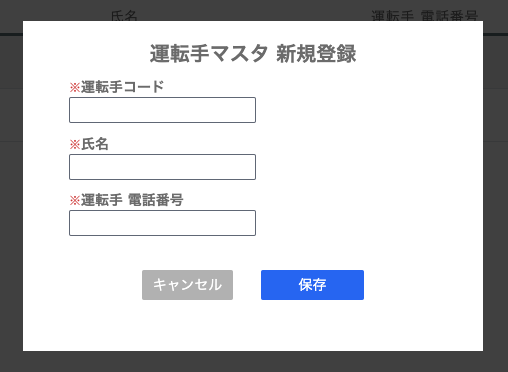
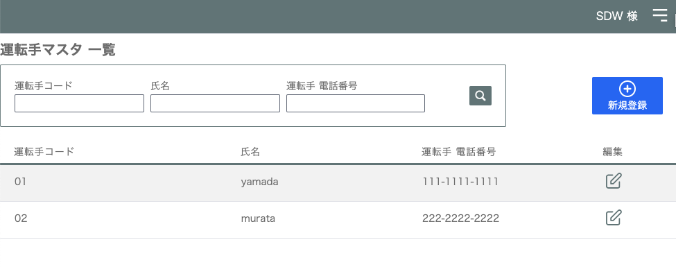

# 車両、運転手マスタ登録する

### 荷姿票で選択するための車両・運転手マスタ登録をします。

1. [出荷票一覧]画面の右上のメニューアイコンから「運転手マスタ」を選択します。

    <table><tr><td>
    
    </td></tr></table>

1. [運転手マスタ一覧]画面で「新規登録」を選択します。

    <table><tr><td>
    
    </td></tr></table>

1. [運転手コード]、[氏名]、[運転手 電話番号]を設定します。

1. 運転手マスタ一覧に登録されます。

    <table><tr><td>
    
    </td></tr></table>

同様に「車両マスタ」の登録を行います。